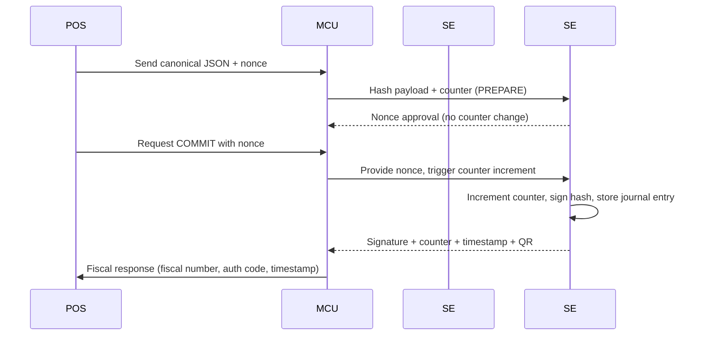

# Secure Element

The Secure Element embedded within the USB Fiscal Memory device is the heart of the trust boundary.  It is the only component that knows the private key used to sign invoices, the monotonic counters that enforce sequencing, and the tamper sensors that prove the device cannot be manipulated.  All other software (POS, fiscal service, cloud) is explicitly untrusted and only interacts with the SE through the USB protocol defined in `spec/protocol-usb-fiscal-device-1.md`.

This page documents the Secure Element's key management and signature algorithm policies for the DRC-compliant invoice flow.

## Security review takeaways

!!! caution "Key lifecycle review"
    The security review confirmed that keys must be **generated on-device** rather than injected from the cloud.  Each Secure Element derives its private key during the `CFG|INIT` activation handshake, using the DGI-provided activation code only to bind the new key to a known device ID.  No private key material ever leaves the sealed chip, preventing remote cloning even if the host is compromised.

!!! warning "Signature algorithm review"
    The review also evaluated ECDSA P-256 vs Ed25519 for this constrained MCU.  ECDSA P-256 won because the selected secure element family (e.g., ATECC608B/SE050) already accelerates P-256, and DGI inspectors expect a curve that matches existing fiscal certs.  We treat Ed25519 as a future-proof option, but we will not ship it until the tax authority and hardware vendor certify the curve.  This signature algorithm decision is our current baseline, and any future curve must demonstrate vendor support and regulatory approval before adoption.

## Key management lifecycle

1. **Activation.** During provisioning, the POS/fiscal service issues `CFG|INIT` with the DGI-signed activation payload and the desired `device_id`.  The Secure Element uses that payload only to seed its internal RNG and bind the generated key pair to the fiscal identity.
2. **Counter binding.** The monotonic counter resides inside the SE and increments with every `TXN|COMMIT`.  The counter value is signed along with the invoice hash so auditors can prove no numbers were skipped.
3. **Certificate chain.** The SE exposes a public certificate that the cloud or DGI can verify; the private key never leaves the device.  A simple challenge-response during `QRY|STATUS` can prove the device still holds the key.

Private key backup is explicitly forbidden.  If the Secure Element is destroyed, the outlet must receive a new device and restart the activation flow.  That policy is enforced by the SE rejecting any attempt to export the key or copy it to another unit.

## Anti-cloning and tamper resistance

The Secure Element arrives in a sealed USB-C, cable-only form factor with no exposed buttons or screens (DISCUSSION.md lines 7343‑7353).  Its packaging, potting compound, and fuses guard against physical tampering:

- Tamper mesh and light sensors detect when the lid is opened and immediately zeroize volatile secrets.
- The SE enforces voltage and clock checks; deviations trigger a lockdown that stops signing until power returns.
- The MCU only sees abstracted SE responses; it cannot read or write private key material, so even compromised firmware cannot clone the device.

!!! tip "Hardware vs software boundary"
    Software responsibilities (UI, syncing, printing, catalog) live outside the sealed box described in the architecture spec.  The Secure Element alone performs invoice issuance, signing, counter management, timestamps, and immutable storage.

## Monotonic counters & immutable signing

Every invoice hash that arrives via `TXN|PREPARE` is hashed again inside the MCU, then passed to the SE along with the current counter value.  The SE enforces a strict PREPARE → COMMIT cycle:

- PREPARE validates schema and nonce without touching the counter.
- COMMIT increments the counter, appends the entry to the hash-chained journal stored in flash, signs the entry with the private key, and returns the fiscal response (fiscal number, auth code, timestamp, QR).

The journal entry links to the previous record via `prev_hash` so auditors can traverse the chain.  Counter increments happen inside the SE, so the host cannot skip any numbers even if it replays COMMIT after power loss.

## Signing flow

The diagram captures the in-device hash-and-sign cycle: the MCU hashes the canonical payload and forwards it to the SE, the SE increments the counter, signs the entry, and streams the signed response back for printing and syncing.

## Recovery and policy

- **Clock protection:** The SE requires signed `CFG|TIME` updates so the RTC cannot roll backward; any rollback attempt rejects new commits.
- **No backup:** Private keys and counters never leave the SE; the only recovery is device replacement and reactivation.
- **Nonce governance:** Nonces expire quickly (7 seconds in the protocol spec) to thwart replay; failed PREPARE/COMMIT pairs force a new nonce request.

!!! danger "Key backup policy"
    Backing up the Secure Element private key is disallowed.  Attempting to clone, dump, or export the key will cause the SE to lock and refuse new URIs until reinitialized via `CFG|INIT`.
