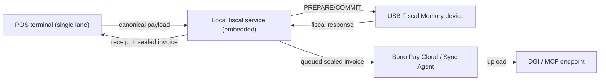
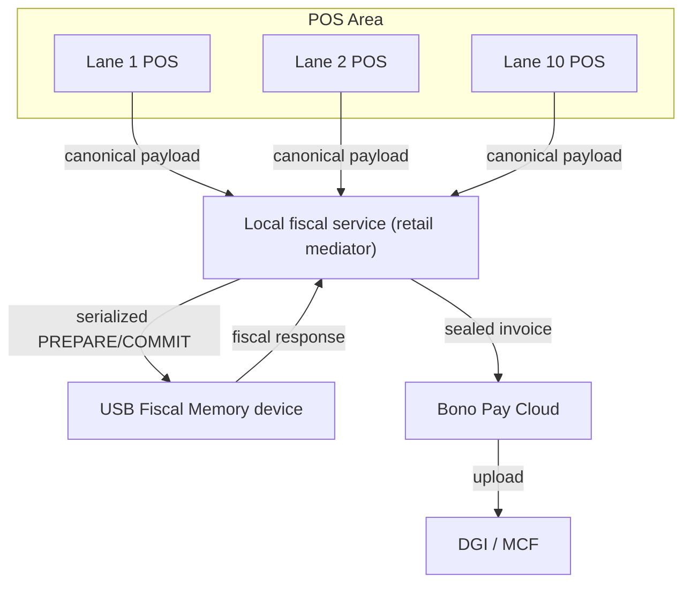
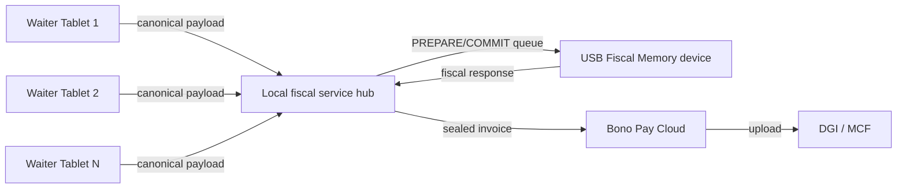

# Multi-terminal orchestration

Bono Pay keeps **one trusted USB Fiscal Memory device per outlet**, so when multiple POS terminals share the same retail counter or restaurant floor, a local fiscal service mediates every interaction. This page explains how that mediator keeps the trust boundary intact while coordinating concurrent terminals, starving the device only one canonical PREPARE/COMMIT stream at a time, and delivering auditable invoices with the required metadata.

## Core principles

- **One device per outlet, not per cashier:** every outlet advertises a single DEF NID and a single monotonic counter. Multiple POS stations rely on that device’s serial number for reporting and audit.
- **Canonical payloads include traceability fields:** every request carries `outlet_id`, `pos_terminal_id`, and `cashier_id` plus the usual merchant, client, items, and tax-engine data so auditors can reconstruct where each fiscal number originated.
- **Local fiscal service acts as the queue:** POS terminals never talk directly to the DEF in a multi-terminal setup; they always send their canonical JSON to the mediator, which serializes PREPARE/COMMIT requests, respects nonce-based 2PC, and forwards only one in-flight command to the device at a time.
- **Trust boundary enforcement:** the device remains the only producer of fiscal numbers, device IDs, signatures, timestamps, and QR codes; the mediator merely relays responses back to the originating terminal.

!!! warning "Trust boundary reminder"
    The DEF never exposes private keys, counters, or auth codes to the POS layer. Even though multiple terminals share a device, **no terminal may fabricate security elements** or bypass the queueing mediator.

## Local fiscal service mediator

The mediator runs inside the outlet’s LAN (or on the same host if it is the POS). It maintains:

1. A **request queue** that orders PREPARE commands across terminals and stores the payload ID until COMMIT completes.
2. A **nonce tracker** that pairs each PREPARE with the matching COMMIT and retries failed exchanges.
3. A **concurrency locker** so that simultaneous POS sessions cannot step on each other and cause duplicate fiscal numbers.
4. A **network router**—POS terminals connect over Wi-Fi or Ethernet (single lane, 10-lane retail, or waiter tablets), while the mediator uses USB CDC to talk to the DEF.

Every payload forwarded to the DEF already includes `outlet_id`, `pos_terminal_id`, and `cashier_id` so that:

- the device’s ledger shows exactly which terminal requested each fiscal number,
- audits or compliance reports can tie violations back to a person,
- offline sync can queue by terminal and preserve sequencing when uploading to the cloud/DGI.

## Payload metadata & concurrency

The DAO ensures that every PREPARE/COMMIT pair is tagged with the terminal hierarchy and that the nonce-based two-phase commit from `spec/architecture-kutapay-system-1.md` resolves races:

- When a PREPARE succeeds, the mediator issues the nonce to the requesting terminal and notes the `pos_terminal_id`.
- If multiple PREPAREs arrive, the mediator buffers them and forwards the next one only after the current COMMIT returns (or fails).
- The DEF increments its monotonic counter only inside COMMIT, guaranteeing **whoever finishes first gets the next fiscal number**; the mediator prevents two terminals from hitting COMMIT simultaneously.
- Rejected PREPAREs immediately bubble an error back to the originating terminal so the cashier can retry rather than issuing a receipt without fiscalization.

Additional safeguards:

- The payload includes cashier identifiers so rollback or refund requests can show who initiated them.
- The mediator tracks audit timestamps and attaches them to the queued entry so offline uploads preserve time order.

## Single-terminal deployment

In a single-terminal outlet the mediator can be embedded in the POS app, but the same flow still applies: canonical payload → queued PREPARE → DEF → fiscal response → receipt/queue. The diagram below depicts the minimal deployment.

## Retail: 10 lanes

Large retailers run up to ten checkout lanes behind a single outlet-level device. POS lanes connect over the same LAN/Wi-Fi to the fiscal service mediator, which serializes every invoice, enforces nonce matching, and ensures queue fairness so that each lane knows when it can send the next PREPARE. The mediator also labels the payloads with `pos_terminal_id` and `lane_number` so auditors will know which lane produced each fiscal number.

## Restaurant: mobile waiters

Restaurants and food halls often deploy mobile waiter tablets that connect back to the same mediator over Wi-Fi, Bluetooth tethering, or a local hub. Each waiter is a POS terminal with unique `pos_terminal_id` and `cashier_id`. The mediator keeps a sliding window of active terminals, forwards PREPARE requests one at a time, and ensures that voids/refunds linked to a table retain the correct fiscal references. Since waiters frequently move, the mediator also tracks connection health and retries PREPAREs when a tablet roams out of range before committing.

## Failure modes and monitoring

The mediator exposes health endpoints so operations teams can see:

1. Which terminal is currently holding the PREPARE/COMMIT lock.
2. How many requests are queued and their statuses.
3. Last good fiscal number returned by the DEF (this is the single source of truth for sequencing; terminals must not guess the next number).

If the device reports an error (memory full, tamper, power loss), the mediator alerts each terminal so the cashier can halt checkouts rather than issuing un-fiscalized receipts. When connectivity returns after offline operation, the mediator continues uploading queued sealed invoices to the cloud/DGI in arrival order.

!!! tip "Why the mediator matters"
    Without the mediator, terminals would compete for the same USB channel and risk slipping outside the trust boundary—this single service keeps the two-phase commit deterministic, tracks terminal IDs, and preserves the sequential fiscal numbers the regulators demand.
