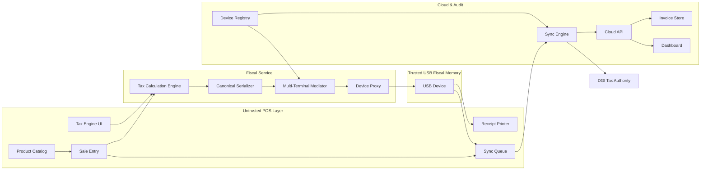
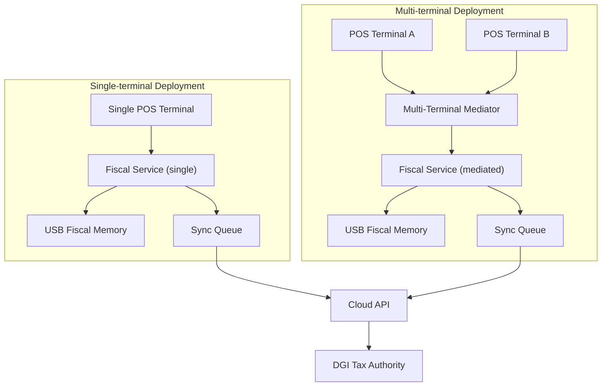

# Component Map

This page captures the actors and services that hold KutaPay together. The goal is to make every dependency and input/output explicit so new engineers can see how the untrusted POS, the trusted USB Fiscal Memory device, and the cloud sync terrain collaborate to satisfy the EARS requirements in `spec/architecture-kutapay-system-1.md`.

!!! warning "Trust boundary reminder"
    The USB Fiscal Memory device is the only component that grades, signs, numbers, and timestamps invoices. Everything else runs in the untrusted zone and must treat device responses as the single source of truth.

## POS Layer Components

| Component | Purpose | Inputs | Outputs | Dependencies |
| --- | --- | --- | --- | --- |
| Sale Entry | Guides the cashier through the invoice, ensuring every line item, price, quantity, and client classification is captured. | Merchant input, Product Catalog metadata, Tax Engine UI configuration, Multi-Terminal Mediator throttling. | Raw transaction record sent to the Tax Calculation Engine and Canonical Serializer. | Product Catalog, Tax Engine UI, Multi-Terminal Mediator. |
| Receipt Printer | Produces the customer-facing fiscal receipt (paper or digital) once the USB device approves the invoice. | Fiscal response (fiscal number, device ID, auth code, timestamp, QR) from the USB device, Sale Entry layout. | Printed/digital receipt for customer and internal audit copies. | USB Fiscal Memory device, Sale Entry, Sync Queue (for archival). |
| Sync Queue | Buffers sealed invoices when the network or DGI are unavailable and orders uploads once connectivity returns. | Canonical payload plus fiscal response, device status from the registry. | Ordered requests delivered to the Cloud API/Sync Engine, status updates to the Dashboard. | Cloud API, Device Registry, Sync Engine. |
| Product Catalog | Stores SKUs, descriptions, tax classifications, and pricing so the POS can reuse them across terminals. | Merchant/ERP imports, dashboard updates. | Enriched items for Sale Entry and Tax Engine UI, trust-labeled tax groups. | Tax Engine UI, Tax Calculation Engine. |
| Tax Engine UI | Lets operators fine-tune 14 DGI tax groups, client types, rounding rules, and refund policies. | DGI regulatory spec, merchant inputs, Product Catalog links. | Tax definitions consumed by Sale Entry, Fiscal Service, and Cloud reporting. | Product Catalog, spec/architecture-kutapay-system-1.md (14 tax groups). |

## Fiscal Service Components

| Component | Purpose | Inputs | Outputs | Dependencies |
| --- | --- | --- | --- | --- |
| Device Proxy | Marshals canonical payloads into PREPARE/COMMIT USB CDC commands, handles retries, and routes responses back to POS. | Canonical JSON, nonce life cycle from the mediator, device health. | Framed USB commands, fiscal responses, error notifications for the POS. | Multi-Terminal Mediator, USB device, Sync Queue. |
| Tax Calculation Engine | Computes amounts for each DGI tax group, supports void/refund flags, and generates the totals that the device must sign. | Sale Entry data, Product Catalog tax tags, Tax Engine UI settings. | Structured tax breakdown handed to the Canonical Serializer and Hash-Chained Journal. | Tax Engine UI, Product Catalog. |
| Canonical Serializer | Builds deterministic JSON with merchant/client IDs, itemized lines, tax breakdown, and outlet/POS/cashier metadata. | Sale Entry capture, Tax Calculation Engine output, Device Registry IDs. | Canonical payload sent to the Device Proxy for PREPARE. | Tax Calculation Engine, Device Registry, Multi-Terminal Mediator. |
| Multi-Terminal Mediator | Coordinates simultaneous terminals, enforces nonce-based two-phase commit (PREPARE → COMMIT), and queues payloads so the trusted device is never overwhelmed. | Concurrent canonical payloads, device health from the registry, USB readiness. | Serialized request stream, conflict alerts, backlog telemetry. | Device Proxy, Device Registry, Sync Queue. |

## USB Device Components

| Component | Purpose | Inputs | Outputs | Dependencies |
| --- | --- | --- | --- | --- |
| Schema Validator | Rejects malformed payloads before counters advance, ensuring the device never accepts sketchy invoices. | Canonical JSON payload from the Device Proxy. | Accept/reject signal, diagnostic code for the POS. | Device Proxy, Tax Calculation Engine. |
| Monotonic Counter | Supplies the next fiscal number in strict sequence for each outlet, preventing gaps or duplicate numbers. | Prepared PREPARE state once the schema passes. | Fiscal number appended to the response and journal entry. | Hash-Chained Journal, RTC. |
| ECDSA Signer | Runs in the secure element to sign the journal entry and produce the authentication code (auth_code). | Hashed invoice data, counter, trusted timestamp. | Auth code stored in the journal and returned to the POS. | RTC, secure element hardware. |
| Hash-Chained Journal | Appends every invoice, void, and refund entry with a pointer to the previous hash so audits can prove immutability. | Signed entries (counter, timestamp, auth_code). | Audit exports, report inputs, ledger proof for DGI. | Monotonic Counter, Report Generator. |
| RTC | Provides the trusted timestamp every fiscal entry and report references, guarding against back-dating. | Periodic CFG|TIME sync commands from the Cloud. | Timestamp values for responses and journal rows. | Cloud API, Device Proxy. |
| Report Generator | Streams Z, X, A, and audit exports out of the journal when auditors or merchants request them. | Hash-Chained Journal, device metadata from the registry. | Report payloads delivered over USB commands or to the cloud. | Hash-Chained Journal, Device Registry. |

## Cloud Layer Components

| Component | Purpose | Inputs | Outputs | Dependencies |
| --- | --- | --- | --- | --- |
| Cloud API | Receives sealed invoices from Sync Engine, publishes device configuration, and surfaces health data to dashboards. | Sealed invoices, device heartbeats, merchant queries. | Acknowledgments to Sync Engine, configuration pushes, metrics to Dashboard. | Invoice Store, Device Registry. |
| Sync Engine | Manages deferred uploads of sealed invoices to the DGI, retries failed transmissions, and tracks synchronization health. | Sync Queue backlog, network availability, DGI responses. | Calls to the DGI endpoint, sync status for the Dashboard, alerts for retries. | Cloud API, Device Registry, DGI credentials. |
| Invoice Store | Keeps a copy of each sealed invoice, its fiscal response, and DGI reference for replays, audits, and dashboards. | Sealed invoices from Sync Engine, metadata from Device Registry. | Queryable records for Dashboard, DGI reconciliation, and analytics. | Cloud API, Sync Engine. |
| Device Registry | Tracks which USB devices are paired to which outlets, their firmware, and last sync sync. | Heartbeats from Fiscal Service and direct device pings. | Metadata for the Multi-Terminal Mediator, gating rules for Sync Engine, input to Dashboard. | Cloud API, Dashboard. |
| Dashboard | Displays device health, upload backlog, report requests, and onboarding guidance so merchant/ops teams can act. | Metrics from Cloud API, invoices from Invoice Store, registry data. | Alerts, onboarding checklists, audit download links. | Cloud API, Device Registry, Invoice Store. |

## System Component Diagram

The diagram below shows how the POS layer, Fiscal Service, USB Fiscal Memory device, and cloud systems interconnect. Canonical payloads traverse the untrusted zone, the trusted device returns fiscal responses, and the cloud syncs sealed invoices to the DGI while providing observability.

The labelled arrows emphasize the canonical payload, the fiscal response, deferred syncs, and the guarded path to the DGI.

## Deployment Scenarios (Single-terminal vs Multi-terminal)

Single-terminal deployments place one POS directly behind the fiscal service, while multi-terminal deployments keep multiple POS nodes synced through the Multi-Terminal Mediator before they reach the shared USB device. Both paths hand off sealed invoices to the same Sync Queue for cloud upload.

The deployment diagram emphasises how the same trusted device and cloud elevator support both single and multi-terminal outlets, ensuring every canonical payload experiences the PREPARE → COMMIT handshake before syncing.
