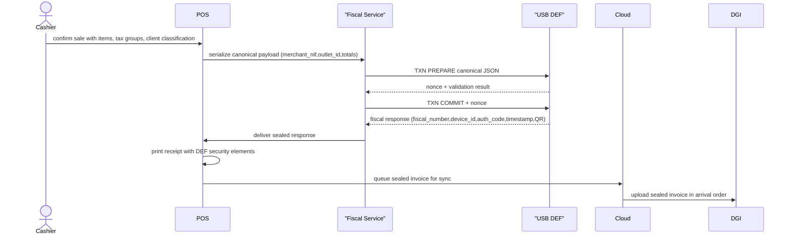
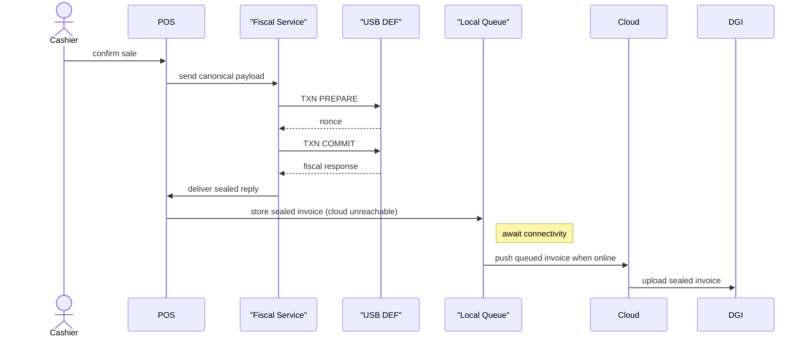
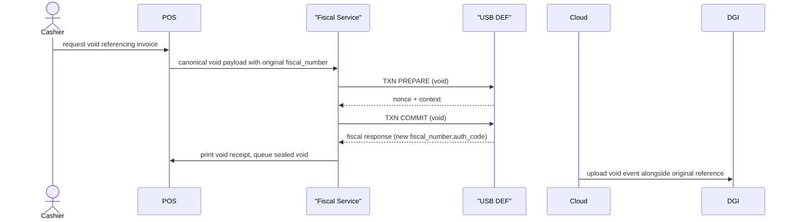
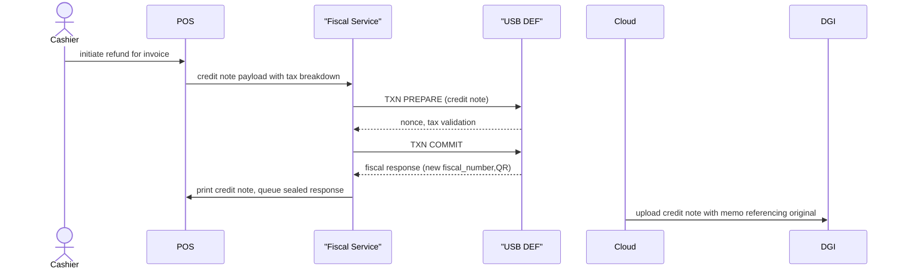
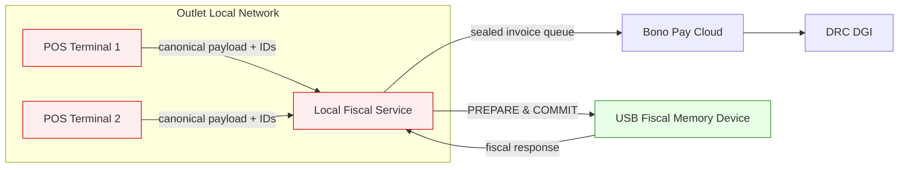

# Data Flow Diagrams

The architecture specification enforces that every fiscal interaction follows the trusted USB device and canonical payload rules. The diagrams below trace how invoices flow through the POS, fiscal service, DEF, cloud, and DGI in normal, degraded, and multi-terminal deployments.

!!! caution "Trust boundary reminder"
    The USB Fiscal Memory device is the only component that can fabricate fiscal numbers, signatures, and timestamps. Every diagram below keeps those primitives inside the trusted zone—no POS, local fiscal service, or cloud component generates them.

## Happy path sequence

The happy path starts with the cashier confirming a sale and ends with the sealed invoice reaching the DGI. The local fiscal service mediates canonical payload creation and the PREPARE→COMMIT handshake before the POS prints and syncs the sealed response.

## Offline-first sequence

When connectivity to the cloud/DGI is down, the device continues to accept PREPARE→COMMIT flows while the POS stores sealed invoices locally. Once the network returns, the queue drains in chronological order so deferred uploads preserve the audit trail.

## Void event sequence

Voids become new fiscal events that reference the original invoice. The POS builds a canonical void payload, the DEF validates the reference and counters, and the system issues a fresh fiscal number for auditing.

## Refund (credit note) sequence

Refunds and credit notes are handled as fresh fiscal events so auditors can trace them back to the original sale while preserving immutable counters and signatures.

## Multi-terminal coordination

Every outlet shares a single DEF. The local fiscal service serializes access from multiple POS terminals, enforces the nonce-based handshake, and attaches outlet/POS/cashier IDs to every canonical request so the USB device maintains sequential ordering per outlet.

