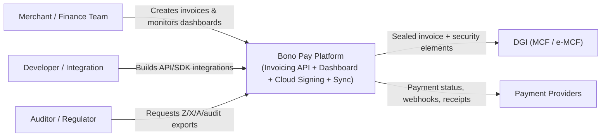
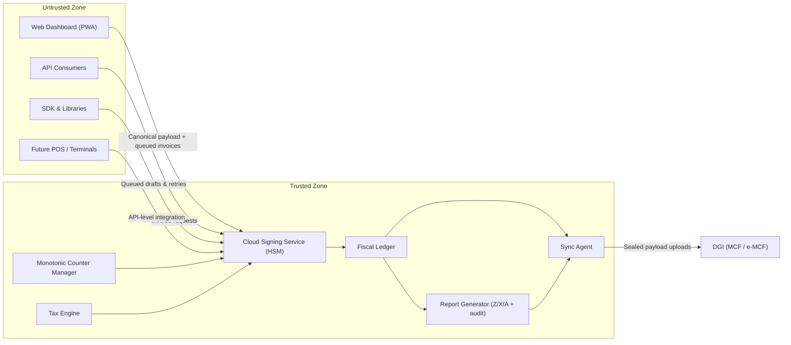
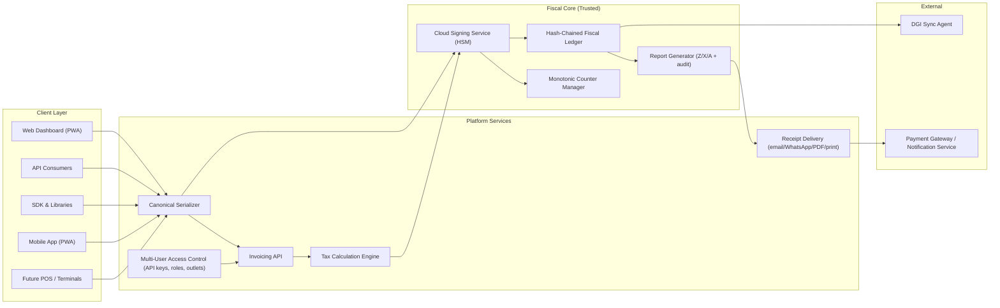

# Architecture Overview

Bono Pay is fiscal invoicing infrastructure for the DRC. This page explains the cloud-first architecture that treats the Cloud Signing Service as the trusted authority, keeps clients in the untrusted zone, and preserves offline behavior inspired by the Odoo lessons (PWA, service workers, IndexedDB queues). We describe who interacts with Bono Pay, why the trust boundary matters, and how the layered components work together to produce sealed invoices, reports, and DGI-ready data.

## System Context (C4)

Merchants, developers, and auditors rely on Bono Pay to fiscalize commerce, document every fiscal event, and surface auditable reports, while the platform shares sealed invoices with the DGI and notifies payment partners about settlement status. The context diagram keeps these actors, the Bono Pay Platform services, and the external systems visible so newcomers can trace how requests flow from the client to the fiscal authority.

## Trust Boundary

The Cloud Signing Service (HSM-backed) is the sole trusted component in Phase 1. All client applications stay untrusted: Web Dashboard (PWA), API consumers, SDKs, and future POS terminals prepare canonical payloads (mandated identifiers, deterministic field ordering, 14 DGI tax groups), queue them locally when offline, and send them to Bono Pay Cloud. The Cloud Signing Service validates the payload, consults the Tax Engine, coordinates with the Monotonic Counter Manager, and produces the five security elements (fiscal number, fiscal authority ID, authentication code, trusted timestamp, QR payload) before returning a sealed response. Clients may only display or deliver those elements and must never fabricate them.

!!! note
    The trust boundary is enforced by the Cloud Signing Service (HSM) in Phase 1. Phase 3 reserves a role for the archived USB Fiscal Memory device as an optional trust anchor, but until DEF homologation is required the cloud produces and stores every security element. Clients can only report back statuses (`fiscalized`, `queued`, `synced`) via the API/Webhooks or the dashboard indicators.

## Component Map

The Bono Pay platform is composed of four layers: clients that originate invoices, platform services that normalize and secure requests, the fiscal core where signing happens, and external integrations that consume sealed data. The component diagram below highlights how sales data flows from dashboards or SDKs into canonical serializers, travels through multi-user policies, reaches the Cloud Signing Service, and finally feeds the fiscal ledger, reports, and sync agents.

## Operational Notes

- **Offline resilience:** Clients use IndexedDB/SQLite queues, service workers, and other Odoo-inspired PWA patterns so tablets can keep capturing invoices even when disconnected. Queued payloads include canonical identifiers (`merchant_nif`, `outlet_id`, `pos_terminal_id`, `cashier_id`, `client`, `tax_groups`, `totals`, `payments`) plus metadata about the user or API key. When connectivity returns, invoices are retried against the Invoicing API and fiscalized by the Cloud Signing Service.
- **Sequential numbering:** The Monotonic Counter Manager enforces serializable isolation per outlet, so every tenant sees strictly increasing fiscal numbers even under concurrent crews, multi-user dashboards, or SDK threads.
- **Security elements & reporting:** The Cloud Signing Service (HSM) never hands out fiscal numbers, signatures, timestamps, or QR payloads to clients; it stores the sealed events in the hash-chained ledger, feeds the Report Generator with Z/X/A/audit exports, and surfaces ledger hashes for compliance reviews.
- **Sync & notifications:** The Sync Agent uploads sealed invoices to the DGI (MCF/e-MCF) and exposes statuses via webhook notifications plus the dashboard's green/yellow/red telemetry. Payment Providers receive delivery updates but never see confidential signing secrets.
- **Phase 3 reminder:** When DEF homologation is required, the archived USB Fiscal Memory device takes over signing for that outlet, but the cloud ledger continues to mirror its outputs for auditability. Until then, the Bono Pay Cloud remains the trusted fiscal authority that developers and finance teams rely on.
