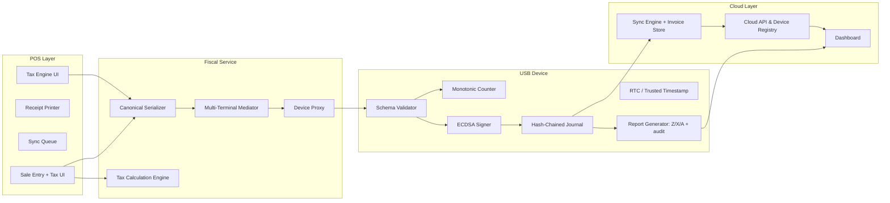

# Architecture Overview

This page gives new developers a grounding in the Bono Pay system: the POS clients that operate in untrusted spaces, the trusted USB Fiscal Memory device that enforces compliance, and the cloud services that consolidate audit data and relay sealed invoices to the DGI. The text below draws directly from the architecture specification, the technical design brief, and the Copilot instructions so that everyone touching the docs stays aligned with the trust boundary, offline-first, and security-element requirements.

## System Context (C4)

Developers joining the project must know who depends on Bono Pay and what the platform communicates outward. Cashiers, outlet owners, and auditors interact with the platform directly, while sealed invoices leave the platform only once they are ready for the DGI or payment providers. This C4 context diagram keeps that actor-level view front and center.

```mermaid
flowchart LR
    Cashier["Cashier / Teller"]
    Owner["Outlet Owner"]
    Auditor["Auditor / Regulator"]
    Bono Pay["Bono Pay Platform\n(POS + Fiscal Service + Cloud)"]
    DGI["DGI MCF / e-MCF"]
    PaymentProviders["Payment Providers"]
    Cashier -->|Issues fiscal invoice| Bono Pay
    Owner -->|Monitors compliance| Bono Pay
    Auditor -->|Requests reports & audits| Bono Pay
    Bono Pay -->|Sealed invoice upload| DGI
    Bono Pay -->|Payment events + status| PaymentProviders
```

## Trust Boundary

The USB Fiscal Memory device is the only trusted execution point: it validates canonical payloads, increments the monotonic counter, signs the invoice, stores it immutably, and returns the security elements (fiscal number, device ID, signature, timestamp, QR). All POS/Cloud services, even the local fiscal service trusted to serialize commands, remain in the untrusted zone and must never claim those security elements as their own.

!!! warning "Trust boundary enforcement"
    Never let the POS or cloud fabric fabricate fiscal numbers, signatures, device IDs, or timestamps. The USB Fiscal Memory device is the sole source of truth; every canonical payload must be serialized, sent via the PREPARE → COMMIT handshake, and the sealed invoice (fiscal response) returned before any receipt is printed or uploaded.

### Trust boundary diagram

```mermaid
flowchart LR
    subgraph Untrusted Zone
        POSApp[POS App + Sync Queue]
        FiscalService["Local Fiscal Service<br/>tokenizes PREPARE/COMMIT"]
    end
    subgraph Trusted Zone
        USBDevice[USB Fiscal Memory Device]
    end
    POSApp -->|Canonical payload\n(outlet_id + pos_terminal_id + cashier_id)| FiscalService
    FiscalService -->|PREPARE / COMMIT\n〈nonce, deterministic JSON〉| USBDevice
    USBDevice -->|Fiscal response\n(fiscal_number, auth_code, timestamp, QR)| FiscalService
    FiscalService -->|Sealed response / receipt print| POSApp
    USBDevice -->|Reports (Z/X/A + audit export)| POSApp
```

## Component Map

The layered component map spells out responsibilities: the POS layer collects items and tax details, the fiscal service mediates multi-terminal concurrency and serializes canonical payloads, the USB device enforces cryptographic seals and journaling, and the cloud layer stores sealed invoices, syncs when connectivity returns, and surfaces dashboards. The Mermaid map below emphasizes how data flows from the cashier through these layers.



## Operational Notes

This architecture must stay offline-first: the local fiscal service queues canonical payloads, negotiates PREPARE/COMMIT with the USB device, and only after receiving the fiscal response does it let the POS print or sync. Multi-terminal outlets rely on the mediator to prevent nonce reuse and to tag every payload with `outlet_id`, `pos_terminal_id`, and `cashier_id` before the USB device increments its per-outlet counter. The cloud layer stores sealed invoices, uploads them in arrival order when connectivity returns, and exposes dashboards/reports to auditors. Every sealed invoice still includes the five mandatory security elements sourced from the trusted device, not the POS.
