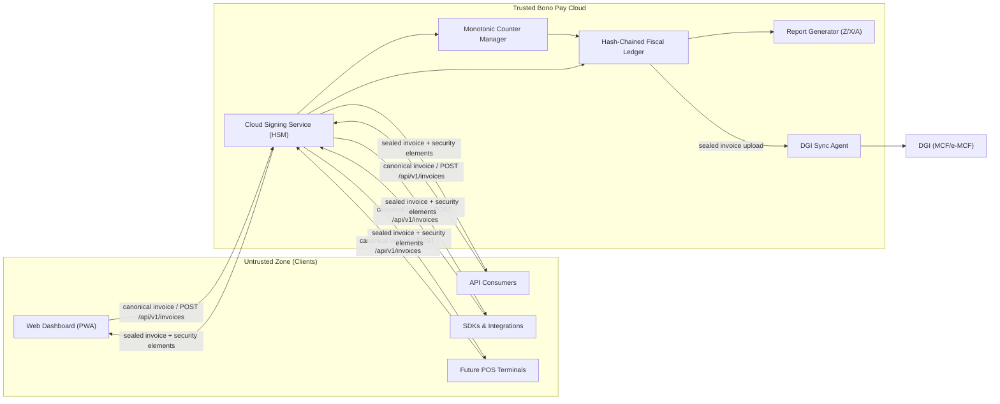

# Trust Boundary

Bono Pay positions the **Cloud Signing Service (HSM-backed)** as the sole trusted fiscal authority in Phase 1. Web dashboards, API consumers, SDKs, and future POS terminals live in the untrusted zone; they author canonical payloads (`merchant_nif`, `outlet_id`, `pos_terminal_id`, `client`, `tax_groups`, `totals`, `payments`, `timestamp`) and deliver them to Bono Pay Cloud for validation, tax calculation, signing, and ledger storage (see `spec/architecture-kutapay-system-1.md`). Nothing that undermines fiscal integrity is permitted to traverse backward across this boundary.

## What crosses the boundary

1. **Canonical invoice requests** — Clients send deterministic JSON through `POST /api/v1/invoices` (or direct API/SDK calls) that include the 14 DGI tax groups, client classification, outlet/scoping identifiers, and payments in the field order mandated by the spec.
2. **Payment metadata & tracing headers** — Each request carries `X-BonoPay-Merchant-ID`, `X-BonoPay-Outlet-ID`, optionally `X-BonoPay-User-ID`/`X-BonoPay-Source`, and other telemetry that lets the Cloud scope the Monotonic Counter Manager per outlet.
3. **Retry/queue health updates** — When dashboards or SDKs flush queued invoices after offline intervals, only the canonical payloads, timestamps, and queue metadata travel into the trusted zone so fiscalization can resume safely.

## What the trusted zone produces

- **Sealed responses** — The Cloud Signing Service returns the five mandatory elements (fiscal number, fiscal authority ID, cryptographic auth code, trusted timestamp, QR payload) plus `ledger_hash`, `dgi_status`, and the signed payload that clients may display or deliver.
- **Ledger entries** — The hash-chained Fiscal Ledger records each fiscal event immutably, linking counters, timestamps, and security elements in PostgreSQL with serializable isolation.
- **DGI upload bundles** — The Sync Agent packages sealed invoices for the DGI (MCF/e-MCF), honoring ack/​retry semantics while never re-signing or mutating the payload.
- **Audit-ready reports** — The Report Generator emits Z/X/A/audit exports derived from the same ledger entries that produced the sealed invoice.

## What never crosses the boundary

- **Private keys or signing material** — HSM-held keys stay inside the Cloud Signing Service. Clients never see them.
- **Raw monotonic counters or journal mutations** — Counter increments and journal writes occur only inside the trusted zone. The Cloud enforces serializable isolation to prevent concurrency issues.
- **Fabricated security elements** — Client applications may only display sealed responses; they cannot invent fiscal numbers, timestamps, auth codes, or QR payloads.
- **Untrusted reports** — Reports described above come solely from the fiscal ledger; dashboards may read them but may not publish unverified totals.
- **Internal health controls** — Metrics like `counter_health` or `nonce_pool` remain within the trusted services; dashboards only surface sanitized statuses.

## Failure modes at the boundary

1. **Cloud Signing Service unavailable** — Clients queue invoices locally (IndexedDB for the dashboard, SQLite for SDKs), display “Queued” indicators, and automatically retry submissions when the connection returns. The queue preserves canonical payload ordering so fiscalization resumes without duplication.
2. **Key rotation inside HSM** — The Cloud handles key rollovers without exposing private material. Clients continue using the same API endpoints; the Cloud signs each request with the active key and surfaces rotation status through monitoring channels.
3. **Counter corruption or serialization violation** — The Monotonic Counter Manager enforces serializable isolation in PostgreSQL, ensuring each outlet receives strictly increasing fiscal numbers. Any anomaly triggers fail-fast alerts and rejects new fiscalization until the ledger reconciles.
4. **DGI sync backpressure** — The Sync Agent queues outbound bundles, retries with exponential backoff if the control module is slow, and surfaces errors to dashboards and webhooks so operators can intervene before compliance gaps emerge.

## Trust assumptions table

| Assumption | Enforcement |
| --- | --- |
| The Cloud Signing Service (HSM) is the only authority that issues fiscal numbers, auth codes, timestamps, and QR payloads. | The HSM + Monotonic Counter Manager run inside Bono Pay Cloud with serializable database isolation, and only sealed responses leave this boundary. |
| Canonical payloads hit the trusted zone before fiscalization and include outlet-scoping metadata plus the 14 DGI tax groups. | API/SDK clients serialize payloads per `spec/architecture-kutapay-system-1.md` and the Cloud rejects schema or ordering deviations before signing. |
| Clients may not fabricate security elements after the trusted zone responds. | The sealed response bundle contains every mandated element (`fiscal_number`, `fiscal_authority_id`, `auth_code`, `timestamp`, `qr_payload`); printers and auditors consume only these values. |
| Multi-user, multi-terminal tenants share fiscal access safely. | Each request includes `merchant_id`, `outlet_id`, and `api_key_id`/`user_id`, so the counter manager scopes numbering and quotas by outlet. |
| Audit reports originate from the hash-chained ledger, not from client caches. | The Report Generator queries the ledger directly (Z/X/A/audit) and exposes signed downloads via the Cloud API. |

## Phase 3 note

Phase 3 introduces the optional USB Fiscal Memory device as a trust anchor for DEF-homologated merchants. When that hardware is deployed, it replaces the Cloud Signing Service for the local outlet while replicating every sealed invoice back to Bono Pay Cloud for ledger consistency and DGI sync (`design/docs-archive/hardware/`). The documentation above keeps the cloud-first story intact but flags the archived USB specs for future reference.
