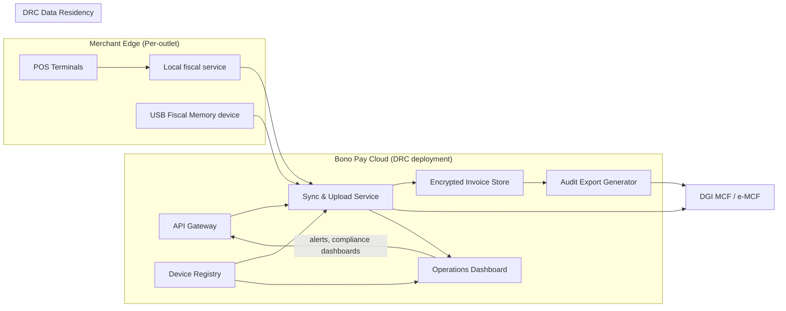

# Cloud Architecture

The Bono Pay Cloud sits on the **trusted side** of the architecture that is described in `spec/architecture-kutapay-system-1.md`. It never touches raw invoice payloads until they are sealed, and it is responsible for every step after the USB Fiscal Memory device emits the fiscal response. The cloud orchestrates sync, backup, DGI uploads, device provisioning, and operational insight while keeping the trust boundary intact and honoring the offline-first guarantees described in `DISCUSSION.md` (see the deployment, offline, and resilience commentary around lines 7030‑7060).

## Responsibilities

- **Sync & upload service** — ingests sealed invoices from the local fiscal service, enqueues them in arrival order, retries uploads when the DGI endpoint is slow or offline, and confirms each invoice has arrived before discarding the local copy.
- **Backup & audit storage** — keeps an encrypted ledger of every sealed invoice, metadata, and fulfillment event so auditors can reproduce Z/X/A reports even if POS terminals lose their local cache.
- **DGI integration** — handles authenticated uploads to the e‑DEF/MCF APIs, respects rate limits, and exposes a retry dashboard for operators when the DGI stack is unavailable.
- **Device registry & provisioning** — tracks each outlet’s DEF serial, activation token, firmware version, and certificate status; it also brokers activation flows that bind a device to a merchant and the DGI’s credentials.
- **Operations dashboard** — surfaces sync health, device connectivity, report generation, and compliance KPIs for auditors and support staff.

!!! warning "Trust boundary reminder"
    The cloud only stores **sealed** invoices: the USB device is the only source of truth for fiscal numbers, device IDs, signatures, timestamps, and QR metadata. Any attempt to reconstruct or mutate those values on the cloud side breaks the trust boundary.

## Deployment model

### Deployment options

1. **Serverless ingestion** — stateless functions (e.g., FaaS) react to new invoices pushed through the fiscal service, validate signatures, and persist them to the audit store. This keeps bursty loads from overloading stateful systems and scales naturally when dozens of outlets sync concurrently.
2. **Containerized services** — longer-running components (dashboard, registry, audit export generator) run inside orchestrated containers with horizontal pods per tenant cluster. Containers host the richer UI, reporting, and heavy CSV/Excel exports that need memory and CPU persistence.
3. **Hybrid pattern** — front-door APIs and sync workers stay serverless for elasticity; the registry, dashboard, and report generation run on containers inside a private cloud/VPC that sits inside the DRC region.

Each deployment option is wired into a multi-tenant namespace (see below) so containers and functions can be scaled independently per customer while still sharing operational tooling, logs, and secrets.

## Multi-tenant & per-outlet isolation

The cloud is multi-tenant by design: every merchant (and by extension, every outlet) receives its own namespace, audit partition, and quota enforcement while still being hosted inside the shared DRC deployment. Tenant metadata flows from the local fiscal service (outlet ID, POS terminal ID, cashier ID) into the registry and sync engine so the cloud can reconstruct per-outlet order and assign the correct device guardrails. Shared tooling (monitoring, billing, backups) reuses the same clusters, but each tenant’s data sits in logically separated buckets with IAM policies, ensuring the single-device-per-outlet guarantee from `spec/architecture-kutapay-system-1.md` remains intact.

A dedicated sync queue per outlet prevents terminal contention: even if multiple POS terminals attempt to upload simultaneously, the queue serializes them before the upload worker touches the DGI API, honoring the arrival order requirement expressed in the architecture spec.

## Data residency & compliance

All cloud workloads run in a **DRC-hosted region** to comply with local data residency expectations (see the regulatory positioning in `DISCUSSION.md` around offline and governance sections). Invoices, logs, and audit exports are stored encrypted at rest, keys are managed within the same region, and TLS enforces encryption in transit. Backups are kept on redundant DRC zones, and any cross-border reporting is delivered through sealed exports (not raw invoice data) so that no sensitive tax information leaves the country without explicit ministerial approval. The cloud also tracks regulatory metadata (compliance deadlines, report cadence, audit trail hashes) so operators can prove they met the DGI requirements described in the SFE summary.

## Deployment diagram

The following Mermaid diagram shows the key deployment elements, how POS/fiscal services connect to the cloud, and how the cloud forwards sealed data to the DGI while keeping everything inside the trusted zone:

