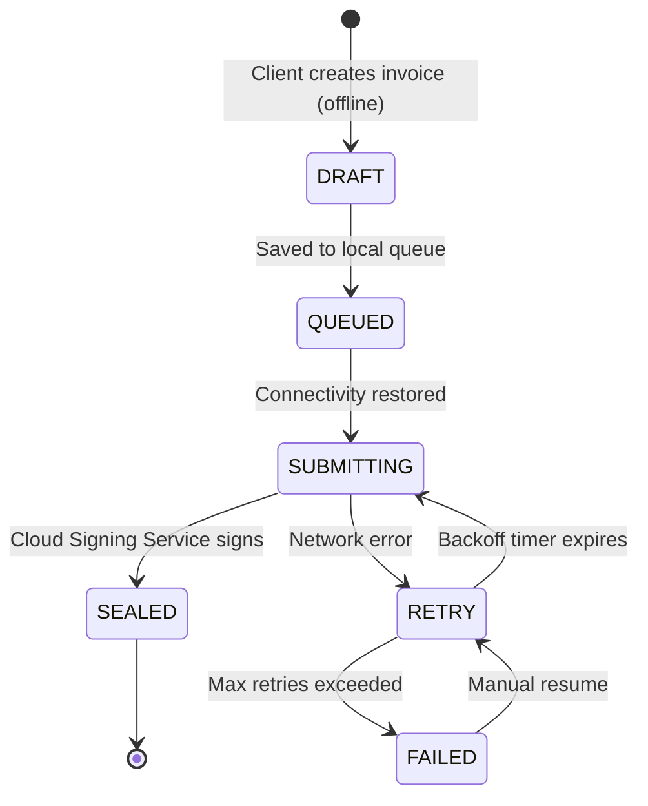

# Offline-First Sync Design

Every invoice issued in the DRC must survive the most hostile networks. Bono Pay's architecture addresses this with a **client-side offline queue**: when the cloud is unreachable, client applications (web dashboard, API consumers, SDK integrators) queue unsigned canonical payloads locally (IndexedDB for web, SQLite for native/SDK) and submit them in order once connectivity returns. **Fiscalization only happens when the Cloud Signing Service (HSM) processes the request** — offline payloads are drafts, not fiscal events.

## Offline model overview

!!! warning "Offline issuance is not a compliance loophole"
    Offline is allowed because merchants cannot halt commerce during connectivity outages. However, the locally queued payload is an **unsigned draft** — it carries no fiscal number, signature, or timestamp. The Cloud Signing Service must seal it before it becomes a fiscal event. The system emits alerts when drafts linger past the configured grace period (e.g., 24 hours) so field teams can investigate before auditors do.

## Client-side queue architecture

Each client application maintains a local queue of unsigned canonical payloads. Each entry stores:

- **canonical payload** — the full invoice payload in deterministic field order (merchant_nif, outlet_id, items, tax_groups, totals, payments, timestamp).
- **payload hash** — detects duplicates across reconnect attempts and prevents double-submission.
- **client metadata** (outlet_id, user_id / api_key_id, source) — supplies traceability for multi-user scenarios.
- **queue position** — the local slot referenced by the sync state machine (QUEUED, SUBMITTING, RETRY, etc.).
- **created_at** — client-side timestamp for grace period monitoring (not used for fiscal purposes).

### Storage backends

| Client type | Storage | Notes |
|-------------|---------|-------|
| Web Dashboard | IndexedDB + Service Worker | Service Worker intercepts `POST /invoices` when offline, stores the payload in IndexedDB, and replays when online. |
| REST API consumer | Caller's responsibility | API clients should implement their own retry queue. The SDK provides a built-in queue. |
| SDK (JavaScript/Python) | SQLite / IndexedDB | Built-in `OfflineQueue` class manages storage, ordering, and submission. |

## Submission flow

When connectivity returns, the client's sync worker submits queued payloads **in creation order** to the Bono Pay Cloud API:

1. **Pick the oldest QUEUED entry** and transition it to SUBMITTING.
2. **POST the canonical payload** to `/api/v1/invoices` with the API key / bearer token.
3. **On success (201):** The Cloud Signing Service returns the sealed response (fiscal_number, auth_code, timestamp, qr_payload). Store the sealed response locally, transition to SEALED, and move to the next entry.
4. **On transient failure (5xx, timeout):** Transition to RETRY with exponential backoff (initial: 5s, max: 5min, jitter: ±20%). After `max_retries` (default: 10), transition to FAILED and raise an alert.
5. **On validation failure (4xx):** Log the error, transition to FAILED, and surface the validation error to the user. Do not retry — the payload needs correction.

!!! tip "Idempotency"
    Each submission includes the `payload_hash` in an `Idempotency-Key` header. If the cloud has already sealed this exact payload (e.g., after a network timeout where the server processed the request but the client didn't receive the response), it returns the existing sealed response instead of creating a duplicate fiscal event.

## Grace period & audit logging

The DGI expects "guaranteed eventual transmission," not best-effort delivery. As soon as a client regains connectivity, the queue flushes payloads in order and records the delay reason (network outage, user session expired, app backgrounded). Each submission attempt appends an audit record that includes:

- Out-of-band delay duration
- The client/user that triggered the retry
- Resulting status (SEALED, RETRY, FAILED)

These logs are part of the "transmission delays are logged and auditable" requirement, so regulators can prove no invoice vanished during long offline spells.

Grace periods should be configurable per deployment, but the default should align with DRC regulators' intolerance for extended "suspicious offline" windows. When the queue detects that a draft has lingered longer than the grace period, it surfaces a warning in the UI and raises a compliance alarm through the cloud dashboard.

## Client UI offline indicators

Client applications should mirror the queue state in the UI. Every draft/invoice shows a badge:

1. **Draft** (gray) — queued in local storage; not yet submitted to the cloud. No fiscal number.
2. **Submitting** (amber) — the sync worker is sending the payload to the Cloud Signing Service.
3. **Sealed** (green) — the Cloud Signing Service returned the fiscal response. The invoice is now a fiscal event.
4. **Retrying** (orange) — transient error; the sync worker will retry after backoff.
5. **Failed** (red) — submission failed after max retries or validation error. Requires manual intervention.

These indicators also drive network status chips (green/amber/red) and action buttons ("Retry now", "Edit and resubmit") to honor the principle that offline is acceptable but must be observable.

## Bandwidth and scheduling optimizations

Low-bandwidth deployments benefit from batching and compression:

- **Batch submissions:** Group queued payloads by outlet and submit them as a batch envelope to `/api/v1/invoices/batch`. The cloud processes each payload individually but returns all sealed responses in one HTTP response.
- **Compression:** Use gzip/Brotli for request/response bodies to reduce bandwidth.
- **Throttling:** Spread submissions over the grace period to avoid burst uploads during peak GSM charges. Apply jitter to backoff timers.
- **Deduplication:** The `payload_hash` + `Idempotency-Key` mechanism prevents duplicate fiscal events even when the client reconnects and replays the queue.

!!! tip "Treat the queue like a compliance ledger"
    Every state transition is proof that the invoice draft existed and was delivered responsibly. Because the Cloud Signing Service never releases a fiscal number until it processes the payload, the queue can safely replay unsigned drafts without risking duplicate issuance. Keep telemetry dashboards on this queue so auditors can reconstruct the whole story if needed.
