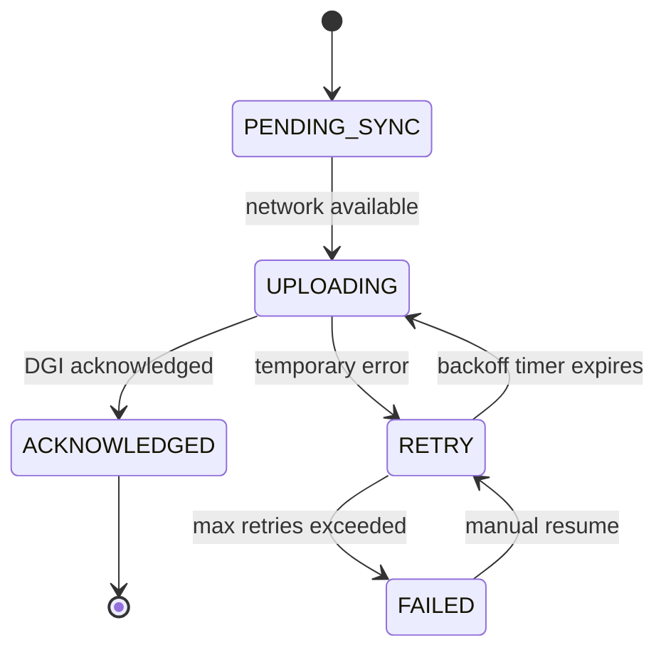

# Offline-First Sync Design

Every invoice issued in the DRC must survive the most hostile networks. `spec/architecture-kutapay-system-1.md` makes this explicit: the USB Fiscal Memory device continues accepting `PREPARE → COMMIT` requests locally when the cloud or DGI are unreachable, and the queued sealed invoices must be uploaded in arrival order once connectivity returns. The offline queue is therefore the single source of truth for deferred transmissions, audit trails, and the compensating controls that keep the audit chain intact.

## Sync queue architecture

Invoices enter the offline queue after the DEF commits them. Each entry stores the sealed canonical payload plus its security elements (`fiscal_number`, `device_id`, `auth_code`, `timestamp`, QR) so nothing outside the DEF can rewrite history. The queue keys the items by the device’s monotonic counter and the host-provided arrival timestamp so the system always uploads in the same order the DEF sealed them. While queued, every invoice record includes:

- **canonical payload hash** – detects duplicates across reconnect attempts.
- **device_id + fiscal_number** – ties it back to the trusted source of truth.
- **host metadata** (outlet_id, pos_terminal_id, cashier_id) – supplies traceability for multi-terminal scenarios.
- **sync position** – the queue slot referenced by the sync state machine (PENDING_SYNC, RETRY, etc.).

!!! warning "Offline issuance is not a compliance loophole"
    Offline is allowed; suspicious offline is not. The queue must never drop, reorder, or compact invoices before the DGI acknowledges receipt, because the law treats delays as audit data that must be logged and reviewed (`DISCUSSION.md`, lines 1479‑1485 & 4730‑4748). The system should emit alerts when invoices linger past the configured grace period (e.g., 24 hours) so field teams can investigate before auditors do.

## Retry logic and conflict resolution

Uploading a sealed invoice is orthogonal to issuance. The DEF is the only authority that prints, signs, and increments counters (`spec/architecture-kutapay-system-1.md`), so retransmissions never mutate fiscal data—they simply replay the previously generated sealed response. The sync service therefore prioritizes idempotent retries with exponential backoff: the queue marks every attempt with a retry count, waits before re-entering `UPLOADING`, and escalates the invoice to `FAILED` only after the `max_retries` threshold so operators can intervene.

Transmission itself can be host-mediated (Model A) or DEF-mediated (Model B), but issuance happens inside the trusted zone alone (`DISCUSSION.md`, lines 4750‑4769). To avoid race conditions, the queue coordinator serializes attempts by ensuring only one uploader speaks to the DGI at a time per outlet. Any duplicate fingerprint detected during retries is logged as a `RETRY` transition, never as a new fiscal event, preserving the “voids/refunds are new events” rule.

## Grace period & audit logging

The DGI expects “guaranteed eventual transmission,” not best-effort bestoers (`DISCUSSION.md`, lines 141‑170). As soon as the POS or the DEF regains connectivity, the queue flushes invoices in arrival order and records the delay reason (network outage, host swap, GSM handover). Each sync attempt appends an audit record that includes the out-of-band delay duration, the host that triggered the retry, and the resulting status (ACKNOWLEDGED, RETRY, FAILED). These logs are part of the “transmission delays are logged and auditable” requirement, so regulators can prove no invoice vanished during long offline spells.

Grace periods should be configurable per deployment, but the default should align with DRC regulators’ intolerance for extended “suspicious offline” windows. When the queue detects that a document has lingered longer than the grace period, it surfaces a `FAILED` state (pending manual recovery) and raises a compliance alarm. This encourages field teams to either re‑establish GSM/Internet links or plug the DEF into a temporary host, keeping the issuance order intact while honoring the audit timeline.

## POS UI offline indicators

The POS UI mirrors the queue state machine. Every invoice shows a badge that switches between:

1. **Offline** – queued in `PENDING_SYNC`; the device has fiscalized but the cloud has not confirmed delivery.
2. **Uploading** – a sync worker has picked the invoice and is waiting for the DGI acknowledgment.
3. **Synced** – DGI acknowledged receipt (ACKNOWLEDGED); the invoice is safe to archive locally.
4. **Retrying / Failed** – the daemon is retrying due to a transient error or waiting for manual recovery after `FAILED`.

These indicators also drive other UI elements such as network status chips (green for connected, amber for limited connectivity, red for extended offline) and action buttons (“Resend now”, “Pack & ship journal”) to honor `DISCUSSION.md`’s suggestion that offline is acceptable but must be observable. Use telemetry (queue depth, max delay) to highlight outlets that are approaching the alert thresholds.

### Invoice sync state machine

## Bandwidth and scheduling optimizations

Low-bandwidth deployments benefit from batching and compression. Group invoices by outlet and exchange them as a single envelope with a manifest that the DGI can verify (`DISCUSSION.md`, lines 1479‑1485 & 4730‑4758). Attach a lightweight delta payload for invoices that the cloud already knows about, and drop unnecessary staging artifacts after the ACKNOWLEDGED state so the queue stays compact.

The sync daemon should also respect “suspicious offline is not” by throttling reconnection storms and avoiding burst uploads during peak GSM charges. Spread retries over the grace period, apply jitter to backoff timers, and never attempt a sync while another upload for the same fiscal number is in-flight.

!!! tip "Treat the queue like a compliance ledger"
    Every state transition is proof that the invoice existed and was delivered responsibly. Because the DEF never releases a fiscal number until `COMMIT` succeeds, the queue can safely replay sealed records without risking duplicate issuance. Keep telemetry dashboards on this ledger so auditors can reconstruct the whole story if needed.
