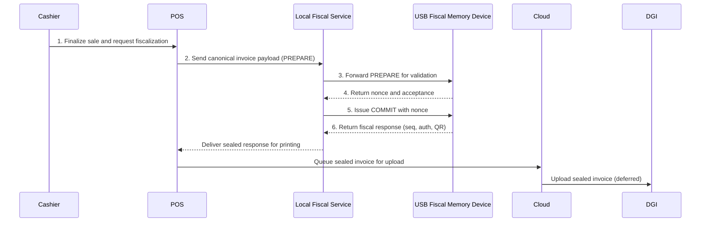
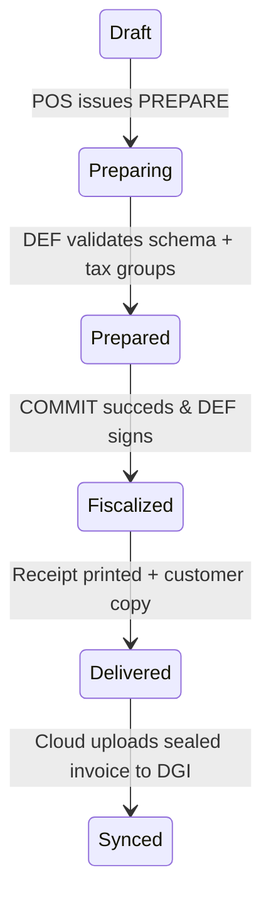

# Invoice lifecycle

## Non-negotiable six-step flow

Every invoice must traverse the same locked-down path so the trust boundary is respected and every fiscal payload carries the device-generated security elements mandated by the DGI. The sequence below captures the actors in the canonical handshake: the cashier, the POS client, the local fiscal service that mediates USB access, the trusted USB Fiscal Memory device (DEF), the cloud sync layer, and ultimately the DGI.

1. The POS gathers the finalized basket, serializes the canonical payload with deterministic field ordering, and asks the fiscal service to issue a PREPARE call.
2. The fiscal service forwards PREPARE to the DEF, which checks schema, tax groups, counters, and replay status but does not yet change state.
3. When the DEF validates the payload, it returns a short-lived nonce and a signal that it is ready to commit.
4. The fiscal service consumes the nonce and sends COMMIT; the device atomically increments the counter, appends the hash-chained journal entry, signs the record, and stores it immutably.
5. The DEF replies with the fiscal response (`fiscal_number`, `device_id`, `auth_code`, `timestamp`, QR) so the POS can print the receipt and mark the invoice as fiscalized.
6. The POS stores the sealed invoice locally, the cloud queue uploads it (still carrying the DEF security elements), and the DGI receives the sealed payload later to close the audit loop.

## Invoice state machine

Every invoice transitions through six explicit states. The state machine prevents skips that would let an invoice appear fiscalized without a matching commit or reports.

`Draft` holds the cashier’s local work-in-progress. `Preparing` and `Prepared` capture the two-phase commit so the DEF can enforce canonical payloads before altering counters. Once `Fiscalized`, the device has immutable proof, and `Delivered` + `Synced` cover the distribution and deferred upload responsibilities.

## Invoice types

The SFE must support every type the DGI requires so no invoice ever circumvents a security path.

| Type | Code | Description |
| --- | --- | --- |
| Sale invoice | `SALE` | Standard retail/wholesale invoice with 14 tax-group breakdowns and DEF security elements. |
| Advance invoice | `ADVANCE` | Prepayment invoice that locks in tax treatment but awaits final receipt; still fiscalized via DEF. |
| Credit note | `CREDIT` | Correction issued after a sale; references the original fiscal number and is sealed as a new fiscal event. |
| Export invoice | `EXPORT` | Duty/export-focused invoice that records customs/product details and uses the same PREPARE→COMMIT flow. |
| Export credit note | `EXPORT_CREDIT` | Refund or correction for an export invoice; binds to the original export fiscal number and still circulates through the DEF. |

## Special flows

### Void flow

A void is never a deletion. The POS flags the original fiscal number, composes a new canonical payload (`invoice_type`: `CREDIT` or a dedicated void indicator), and sends it through PREPARE → COMMIT exactly like any invoice. The DEF records a new sequence value, links the journal entry to the void reason, and emits its own fiscal response. Auditors follow the link from void to original; no prior record disappears.

### Refund (credit note) flow

Credit notes are new fiscalized events. The POS references the original `fiscal_number` and `invoice_type`, builds a payload that includes the refund totals and tax reversals, and runs it through the same two-phase commit. The DEF issues a brand-new fiscal number/auth code while preserving the trace back to the original invoice for reconciliation.

### Draft cancellation

If the cashier cancels before PREPARE/COMMIT, the invoice never touches the DEF. The cancellation happens in the POS application with no fiscal number assigned, no journal entry created, and no audit trail—because the work never reached the trusted layer.

!!! warning "Nothing is ever deleted"
    Every fiscal event is an append-only entry. Voids, refunds, and corrections create new invoices that reference the originals; there is no way to rewrite or drop the records once they leave the POS. This rule keeps the hash-chained ledger intact and aligns with the DGI mandate.

## References

- `spec/architecture-kutapay-system-1.md` (trust boundary, canonical payload, actors)
- `docs/sfe-specifications-v1-summary.md` (invoice types, security elements, immutability)
- `.github/copilot-instructions.md` (invoice lifecycle and trust boundary rules)
