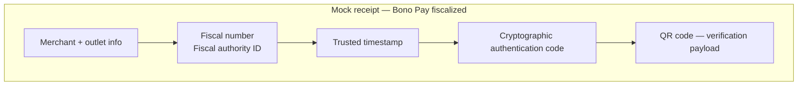

# Security Elements on Invoices

The DGI SFE specification and the Bono Pay architecture mandate that every fiscal event carries **five immutable security elements**. In Phase 1 (Software Invoicing), the **Cloud Signing Service (HSM)** owns the counters, identifiers, timestamps, and signatures that prove an invoice was issued by an authorized system. Client applications (web dashboard, API consumers, SDK integrators) must treat these values as sealed outputs — they may display them but never fabricate or modify them.

!!! warning "Cloud-generated security elements"
    Client applications MAY NOT fabricate any of these values. They are generated inside the Cloud Signing Service (HSM), travel only in sealed responses, and are recorded in the append-only Fiscal Ledger. Missing or modified elements invalidate the invoice.

!!! info "Phase 3 — USB Hardware"
    In Phase 3, the USB Fiscal Memory device (DEF) can replace or augment the Cloud Signing Service as the trusted signer for merchants who need full DEF homologation. The five elements remain identical; only the generation source changes. Hardware details are archived in `docs-archive/hardware/`.

## Sequential fiscal invoice number

- **What it is:** A monotonic, non-resettable counter that assigns every invoice a unique fiscal number and anchors the hash-chained Fiscal Ledger used for reports.
- **Generated by:** The Cloud Signing Service via the **Monotonic Counter Manager**, which uses serializable database isolation to guarantee gap-free sequential numbering per outlet.
- **Receipt placement:** Prominently printed near the merchant header so auditors see the outlet-level fiscal sequence.
- **Verification:** The dashboard, API consumers, and DGI compare the printed number with the Fiscal Ledger entry, the Z/X reports, and the expected counter for that outlet.
- **Missing / invalid:** The invoice is immediately rejected by the DGI and cannot be synchronized; the client must re-submit the canonical payload so the Cloud Signing Service can issue a new fiscal number.

## Fiscal authority ID

- **What it is:** A unique identifier for the Cloud Signing Service instance (or HSM cluster) that produced the fiscal response. In Phase 3, this maps to the DEF NID for USB-signed invoices.
- **Generated by:** Assigned during HSM provisioning; the Cloud Signing Service includes it in every sealed response alongside the fiscal number and signature.
- **Receipt placement:** Printed beside the fiscal number in the security block so inspectors can trace the signing authority.
- **Verification:** Auditors and the DGI cross-check the fiscal authority ID against the registered HSM public key in the Bono Pay Cloud registry.
- **Missing / invalid:** Without a fiscal authority ID, the invoice cannot be tied to a certified signing service, and the DGI must mark it non-compliant.

## Cryptographic authentication code (signature)

- **What it is:** An ECDSA signature over the canonical payload, fiscal number, timestamp, and ledger metadata that proves the Cloud Signing Service approved the invoice.
- **Generated by:** The HSM inside the Cloud Signing Service using managed private keys that never leave the hardware security boundary.
- **Receipt placement:** Included in the security block or encoded inside the QR code so scanning software can verify it.
- **Verification:** The DGI, auditors, and Bono Pay dashboard validate the signature using the HSM's public key from the registry; signatures that fail verification trigger rejection.
- **Missing / invalid:** If the signature is absent or fails verification, the invoice is treated as unauthenticated and cannot be lodged with the DGI; the client must re-submit the payload for re-signing.

## Trusted timestamp

- **What it is:** A UTC timestamp anchored to NTP-synced cloud infrastructure that records when the Cloud Signing Service sealed the invoice.
- **Generated by:** The Cloud Signing Service at the moment of signing; it cannot be supplied or overridden by client applications.
- **Receipt placement:** Shown near the fiscal number / authority ID block and embedded in the QR payload to prove when the invoice was sealed.
- **Verification:** The Fiscal Ledger enforces monotonic ordering per outlet; the DGI and auditors compare timestamps against ledger order to detect drift or replay.
- **Missing / invalid:** Invoices without a trusted timestamp are non-compliant, cannot be reconciled with Z/X reports, and raise alerts for potential tampering.

## QR code encoding verification data

- **What it is:** A machine-readable encoding of the fiscal number, fiscal authority ID, timestamp, signature, and a verification URL so inspectors and the DGI can validate the invoice.
- **Generated by:** The Cloud Signing Service after signing; the QR payload contains the sealed data that client applications render on receipts and the Sync Agent uploads to the DGI.
- **Receipt placement:** Typically printed at the bottom of the receipt, adjacent to the totals and security block.
- **Verification:** Inspectors and software scan the QR code to replay the data, validate the signature, and confirm the fiscal authority match.
- **Missing / invalid:** Without the QR code the invoice fails the compliance checklist, and the DGI upload pipeline flags it as incomplete.

## Mock receipt layout

The diagram above shows how the five security elements are grouped near the receipt header and security block so every printout carries the data inspectors need. The QR code encapsulates the entire sealed payload, making verification a single scan away.

## Maintaining compliance

Client applications always send the canonical payload to the Cloud Signing Service, which returns the five sealed security elements. Even when a client is temporarily offline, it queues the unsigned payload locally (IndexedDB / SQLite) and submits it once connectivity returns — fiscalization only happens when the Cloud Signing Service processes the request. Missing elements, altered values, or attempts to generate them outside the Cloud Signing Service immediately invalidate the invoice and keep it out of the audit trail. If a submission fails (network timeout, validation error), the client retries the request so the Cloud Signing Service can issue all five elements together.
