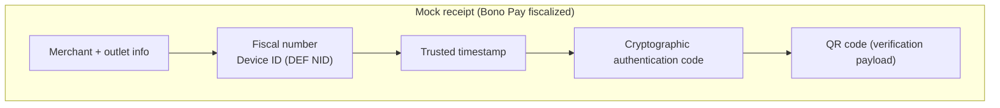

# Security elements on invoices

The DGI SFE specification and the Bono Pay architecture rules mandate that every fiscal event carries five immutable security elements. The USB Fiscal Memory device (DEF) owns the counters, identifiers, timestamps, and signatures that prove an invoice was issued by an authorized system; the POS, fiscal service, and cloud must treat them as sealed outputs. This page explains what each element is, who produces it, where it appears on the receipt, how the system verifies it, and what to do when it is missing.

!!! warning "Device-generated security elements"
    The POS MAY NOT fabricate any of these values. They must be generated inside the DEF, travel only in sealed payloads, and stay embedded in the hash-chained journal (spec/architecture-kutapay-system-1.md; docs/sfe-specifications-v1-summary.md). Missing or modified elements invalidate the invoice.

## Sequential fiscal invoice number
- **What it is:** A monotonic, non-resettable counter that assigns every invoice a unique fiscal number and anchors the hash-chained journal used for reports.
- **Generated by:** The DEF each time a PREPARE → COMMIT cycle concludes successfully (kutapay_technical_design.md §5 and spec file).
- **Receipt placement:** Prominently printed near the merchant header so auditors see the office/local sequence.
- **Verification:** The cloud, dashboard, and DGI compare the printed number with the journal entry, the Z/X reports, and the expected counter for that device.
- **Missing / invalid:** The invoice is immediately rejected by the DGI and cannot be synchronized; operators must reissue the transaction after the DEF issues a new fiscal number.

## Device ID (DEF NID)
- **What it is:** A unique identifier assigned to each DEF (also called DEF NID) that proves which device produced the fiscal response.
- **Generated by:** The trusted hardware during provisioning; the DEF includes it in every response alongside the fiscal number and signature.
- **Receipt placement:** Printed beside the fiscal number (and often in the security block) so inspectors can trace the outlet/device pair.
- **Verification:** The cloud compares it to the device registry; auditors can cross-check it against the DEF’s public key metadata in the registry.
- **Missing / invalid:** Without a DEF ID the invoice cannot be tied to a certified device, so the DGI and Bono Pay cloud must mark it non-compliant and block further uploads.

## Cryptographic authentication code (signature)
- **What it is:** A device-generated cryptographic signature over the canonical payload, counter, timestamp, and report metadata that proves the DEF approved the invoice.
- **Generated by:** The Secure Element inside the DEF using the device’s private key (docs/sfe-specifications-v1-summary.md, kutapay_technical_design.md §5).
- **Receipt placement:** Included in the security block or encoded inside the QR code so scanning software can read and verify it.
- **Verification:** The cloud, auditors, and DGI validate the signature using the DEF public key from the registry; signatures that fail to verify trigger rejection.
- **Missing / invalid:** If the signature is absent or fails verification, the invoice is treated as unauthenticated and cannot be lodged with the DGI; the sale must be repeated with a new fiscalization.

## Trusted timestamp
- **What it is:** The DEF’s trusted clock value that timestamps the PREPARE → COMMIT event.
- **Generated by:** The DEF’s RTC (linked to the secure element); it cannot be supplied by the POS or cloud.
- **Receipt placement:** Shown near the fiscal number/dev ID block and embedded in the QR payload to prove when the invoice occurred.
- **Verification:** The cloud compares it against the DEF journal order (must be monotonic per outlet) and the offline queue to detect drift or replay.
- **Missing / invalid:** Invoices without a trusted timestamp are non-compliant, cannot be reconciled with Z/X reports, and raise alerts for potential tampering.

## QR code encoding verification data
- **What it is:** A machine-readable encoding of the fiscal number, DEF ID, timestamp, signature, and other verification payloads required by inspectors and the DGI.
- **Generated by:** The DEF after COMMIT; the QR code contains sealed data that the POS prints and the cloud uploads verbatim (docs/sfe-specifications-v1-summary.md).
- **Receipt placement:** Typically printed at the bottom-right of the receipt, adjacent to the totals and security block.
- **Verification:** Inspectors and software scan the QR code to replay the data, validate the signature, and confirm the device/partner match.
- **Missing / invalid:** Without the QR code the invoice fails the compliance checklist, and automated DGI upload tooling will flag it as incomplete.

## Mock receipt layout

The diagram above shows how the five security elements are grouped near the receipt header and security block so every printout carries the data inspectors need. The QR code encapsulates the entire sealed payload, making verification a single scan away.

## Maintaining compliance

Even when offline, the DEF must continue generating these elements locally; the POS/cloud only forwards the sealed responses (spec/architecture-kutapay-system-1.md). Missing elements, altered values, or attempts to generate them outside the DEF immediately invalidate the invoice and keep it out of the audit trail. If a failure occurs (power loss, disconnected USB), the POS retries the PREPARE step so the DEF can reissue all five elements together.
