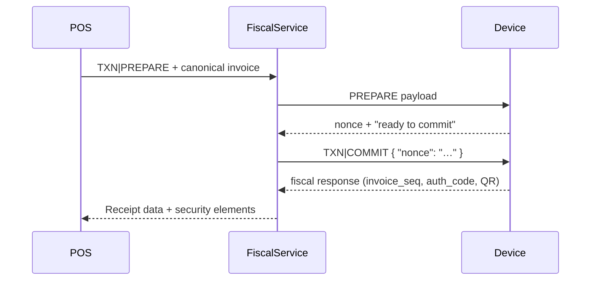

# USB Fiscal Device Protocol

This page summarizes the **TXN / QRY / RPT / ADM / CFG** commands that flow between the untrusted POS/fiscal service cluster and the trusted USB Fiscal Memory device. The full machine-readable definition lives in the [protocol specification](../../../spec/protocol-usb-fiscal-device-1.md), and ADR-0001 explains why the two-phase handshake is the only compliant option ([read it here](../../../docs/adr/adr-0001-two-phase-commit-usb-protocol.md)).

!!! warning "The DEF is the only fiscal authority"
    ADR-0001 mandates that no receipt may reach a customer unless the DEF has fully committed it (PREPARE → COMMIT → signed response). The POS must never print or queue a receipt before receiving the COMMIT response and verifying the `invoice_seq`, `auth_code`, and device timestamp.

## Command families
| Family | Primary commands | Role |
| --- | --- | --- |
| **Transaction (TXN)** | `TXN|PREPARE`, `TXN|COMMIT` | Nonce-based 2PC that validates and signs canonical invoices before exposing the security elements. |
| **Query (QRY)** | `QRY|STATUS`, `QRY|LOG <seq>` | Health checks, recovery after power loss or crashes, and audit lookups. |
| **Reports (RPT)** | `RPT|Z`, `RPT|X`, `RPT|A` | Z (daily closure), X (periodic snapshot), and A (article-level) reports generated in-device. |
| **Admin (ADM)** | `ADM|DUMPLOG`, `ADM|RESET` | Exporting the hash‑chained journal and resetting counters under DGI authorization. |
| **Configuration (CFG)** | `CFG|TIME`, `CFG|INIT` | Clock synchronization, device activation, and key provisioning. |

## Canonical payload checklist
Every `TXN|PREPARE` payload **must** follow the order in the [protocol specification](../../../spec/protocol-usb-fiscal-device-1.md). Include:

- Merchant metadata (`merchant_nif`, outlet/terminal/cashier IDs, invoice type).
- ISO 8601 timestamp that matches the device RTC.
- Client + classification block (Individual, Company, Commercial Individual, Professional, Embassy).
- Item list with code/description, quantity, unit price, and tax group.
- Tax group breakdown (code, rate, base, amount) for all 14 DGI tax groups.
- Totals object (`subtotal`, `total_vat`, `total`, `currency`).
- Payments array describing each instrument/method.

Duplicating this order guarantees deterministic hashes and keeps signatures reproducible per Section 5.2 of the DISCUSSION document.

## Sequence diagrams

### Happy path (PREPARE → COMMIT)


### Error path (schema or policy violations)
```mermaid
sequenceDiagram
    participant POS
    participant FiscalService
    participant Device
    POS->>FiscalService: TXN|PREPARE (malformed payload)
    FiscalService->>Device: PREPARE
    Device-->>FiscalService: ERR SCHEMA_INVALID
    FiscalService-->>POS: Alert cashier; show resolver UI
    POS->>FiscalService: TXN|PREPARE (canon payload retried)
```

### Power-loss recovery
```mermaid
sequenceDiagram
    participant POS
    participant FiscalService
    participant Device
    POS->>FiscalService: TXN|PREPARE
    FiscalService->>Device: PREPARE
    Device-->>FiscalService: nonce
    FiscalService->>Device: TXN|COMMIT
    Device---x Device: power loss during COMMIT
    POS->>FiscalService: QRY|STATUS
    FiscalService->>Device: STATUS
    Device-->>FiscalService: next_invoice_seq still 105
    FiscalService->>Device: QRY|LOG 105
    Device-->>FiscalService: log_entry (or "not found")
```

## Failure handling and rules
!!! caution "Nonces must never be reused"
    Per ADR-0001, every COMMIT must carry the nonce issued by PREPARE. An invalid nonce yields `INVALID_NONCE` and a nonce that outlives its TTL yields `NONCE_EXPIRED`. The POS must restart the invoice flow (i.e., send a new `TXN|PREPARE` with the same canonical payload) rather than trying to reuse the old nonce.

Device errors (`SCHEMA_INVALID`, `STORAGE_FULL`, `CLOCK_ROLLBACK_DETECTED`, `DEVICE_REVOKED`) always return `status: "ERR"` with a `code` field. The POS displays contextual guidance and only retries when the error signal indicates a temporary condition (`DEVICE_BUSY`, `STORAGE_FULL` after freeing space, `SCHEMA_INVALID` after user correction).

!!! warning "No un-fiscalized receipt"
    If the POS loses the fiscal response (COMMIT success but crash before printing), it must recover by querying `QRY|LOG <seq>` and reprint the missing ticket. Printing without a fiscal response violates the DRC mandate and is detectable by auditors (see ADR-0001, Section 5).

## Additional resources
* [Protocol specification](../../../spec/protocol-usb-fiscal-device-1.md)
* [ADR-0001: Two-phase commit](../../../docs/adr/adr-0001-two-phase-commit-usb-protocol.md)
