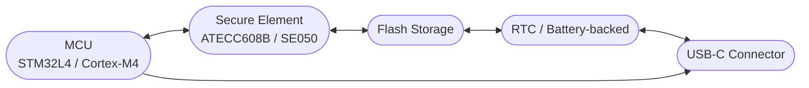

# USB Fiscal Memory Device

KutaPay's USB Fiscal Memory device is the trusted anchor of the fiscal compliance stack. It sits inside the trust boundary, listens to canonical payloads from the untrusted POS, and emits sealed fiscal responses that the POS prints and the cloud eventually uploads to the DGI. Every fiscalized invoice flows through this hardware so it alone controls counters, timestamps, signatures, and the immutable journal.

!!! warning "Trusted boundary"
    Only the USB Fiscal Memory device may increment counters, sign journals, or emit authentication codes. The POS and cloud may prepare payloads and relay responses, but they must never forge or cache these sensitive elements.

## Purpose and Form Factor

The device is a compact, matte-black module roughly the size of a key fob, with a single USB-C female port on one end and a removable cable that lets merchants plug into phones, tablets, or PCs without stressing the enclosure. A subtle lock icon and a recessed blue LED speak to its security-focused purpose while staying unobtrusive in retail or mobile scenarios. Its sealed housing resists dust, drops, and the tropical heat common in the DRC, and the detachable cable lets the wiring absorb flex while the module stays solid.

### Indicators and Tamper Responses

A single blue LED communicates operational states: steady when ready, blinking during PREPARE/COMMIT exchanges, amber when storage is nearing capacity, and red when a tamper or fatal error is detected. Internal tamper detection (e.g., magnetic switches or tamper-evident seals) forces the firmware into a safe state, alerts the POS with an error code, and refuses to fiscalize until servicing restores integrity. The LED and tamper logic keep the device from silently issuing invoices under suspicious conditions.

### Environmental Hardening

The hardware is designed for dusty marketplaces, humid kiosks, and unreliable power. It runs inside an industrial-grade plastic or aluminum shell, protects electronics with potting or conformal coatings, and uses power-conditioning circuitry so brief surges do not corrupt the flash journal. Firmware guards against clock rollback by refusing to issue new entries until the onboard RTC (backed by a coin-cell or supercap) shows steady progression, and the flash storage is kept transactional so brownouts either complete or roll back cleanly.

## Functional Responsibilities

- **Maintain monotonic counters** for every invoice type (sales, advances, credit notes, exports). The counter cannot decrement, roll back, or skip numbers, and it powers the sequential fiscal number printed on receipts.
- **Log every fiscal event** in flash with hash chaining so auditors can prove immutability even when the POS is offline. The log contains invoice metadata, tax breakdowns, and references to the prior entry so tampering is detectable.
- **Apply trusted timestamps** using the onboard RTC and cross-checks, ensuring each invoice record carries a chronological time even if the POS clock is manipulated.
- **Generate cryptographic authentication codes** by hashing invoice details (canonical payload) and signing them inside the secure element (ATECC608/SE050). The resulting code is returned to the POS, printed, and embedded in the QR.
- **Store sealed responses** until the POS confirms and prints a receipt. Responses include device ID, fiscal number, auth code, and status so the merchant never prints without a fiscalized invoice.
- **Produce reports** (Z, X, A, audit export) directly from the secure journal, exporting daily closures or article-level detail on demand without involving the POS.
- **Operate offline** without cloud or DGI connectivity, continuing PREPARE → COMMIT flows and buffering audit data for later sync. It only refuses invoices when flash is full, tamper is detected, or policy forbids issuance (e.g., clock rollback).
- **Emit failure states** through error codes and the LED so the POS can notify cashiers and halt fiscalization rather than issuing non-compliant receipts.

## Internal Architecture Block Diagram

The MCU orchestrates the PREPARE/COMMIT handshake, drives the LED/tamper GPIOs, and hands sensitive signing operations to the secure element. Flash preserves the hash-chained journal, the RTC anchors time, and the USB-C connector exposes the transactional USB CDC interface to the fiscal service mediator. All firmware paths route through this chain so the device remains a single source of truth.

## Operations & Reports

The DEF reports Z (daily closure), X (periodic/session summary), A (per-article detail), and audit exports straight from the hash-chained log, ensuring every report entry shares the same security elements as invoices. During power losses or timeouts, the PREPARE/COMMIT exchange either completes or rolls back, preventing phantom invoices. Error codes like "memory full" or "tamper" are surfaced to the POS, which halts further fiscalization and displays the LED state until maintenance resolves the issue. Because the device keeps a unique DEF ID (DEF NID) in every record, auditors can trace each invoice back to the precise hardware unit even when multiple POS terminals share the same device.

## BOM & Manufacturing

Target COGS stays within the $10–15 range by relying on commodity yet certified components and a minimalist enclosure. The table below captures the high-level parts list and their purpose:

| Component | Example Part | Description | Unit Cost (USD) | Notes |
|-----------|--------------|-------------|----------------|-------|
| Secure MCU | STM32L4 / NXP Kinetis | Controls the PREPARE/COMMIT flow, orchestrates peripherals, and runs watchdog-backed firmware | 3.00–5.00 | ARM Cortex-M4/M33 with crypto accelerators |
| Secure Element | ATECC608B / SE050 | Stores private keys, performs ECDSA (or EdDSA) signing, enforces tamper/protection policies | 1.00–2.00 | Certified for FIPS/CC; no private key leaks |
| Flash Storage | SPI NOR Flash (4–16 MB) | Hash-chained journal, report logs, firmware rollback | 0.50–1.50 | Fast writes with transactional support |
| RTC | DS3231 / integrated RTC | Trusted timestamp source with battery/supercap backup | 0.50–0.75 | Prevents time rollback abuse |
| USB Interface | USB-C connector, power conditioning | 10 Gbps-capable port with ESD protection and surge filtering | 0.50–1.00 | Provides the only external I/O |
| Indicators & Sensors | LED + tamper switch | Single status LED plus tamper detection switches/magnets | 0.25–0.40 | LED shows ready/error states; tamper forces safe mode |
| Mechanical & PCB | 4-layer PCB, enclosure, detachable cable | Rugged board and housing with molded USB-C cable (or reinforced jack) | 2.00–3.00 | Includes EMI shielding, conformal coat, tooling |
| Misc. | Assembly, calibration | Factory assembly, security laser etching, verification | 0.50–1.00 | Includes serialization of DEF NID |

*Total COGS targets $10–15 per unit while still supporting audit-grade hardware and tamper detection.*

## Comparative Positioning

Compared to Italian fiscal memories and other African Electronic Fiscal Devices (EFDs), the KutaPay DEF matches the same sequential counters, Z/X/A reports, and tamper-proof journal but adds a detachable USB-C cable that suits modern tablets and mobile cashiers. Against crypto-focused hardware wallets, it borrows their secure element model (isolating private keys, enforcing monotonic counters) while extending it with a dedicated invoice journal, RTC, and DGI-friendly reporting. These similarities keep certification straightforward while differentiating KutaPay through its tight integration with the offline-first POS, local fiscal service mediator, and DGI sync pipeline.
