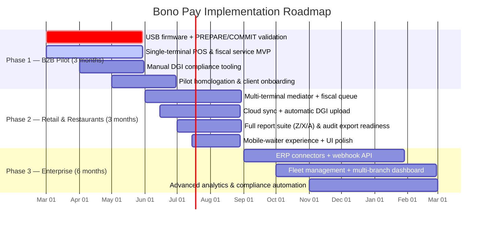

# Implementation Roadmap

## Overview
This document lays out the phased rollout for Bono Pay’s fiscal compliance platform, beginning with a tightly scoped B2B pilot, scaling through retail and restaurant multi-terminal deployments, and culminating in an enterprise-grade offering with ERP/webhook integrations and analytics. Each phase has a fixed duration (Phase 1 & Phase 2 are three months each, Phase 3 spans six months) and builds on the architecture, hardware, and fiscal-engine work captured earlier in the technical design docs.

## Timeline
The Gantt chart below visualizes the overlapping deliverables, dependencies, and validation checkpoints that keep the rollout on schedule.

## Phase 1 — B2B Pilot

### Milestones
- Finish USB Fiscal Memory firmware that implements the PREPARE → COMMIT cycle, immutable journal, and report generation.
- Deliver the single-terminal POS + fiscal service bundle with canonical payload serializer, tax engine UI, and receipt printer integration.
- Ship manual DGI compliance tooling (CSV export, audit dump, Z/X/A report generation) to support homologation.
- Onboard the first 10 pilot clients (service companies, wholesalers, schools) and validate the offline-first behavior together with the cloud sync queue.

### Dependencies
- Architecture overview/trust boundary docs (design/docs/architecture/*) and spec/architecture-kutapay-system-1.md to prove the zones of trust before device deployment.
- Hardware pages (design/docs/hardware/*.md) and the USB device protocol to fix the BOM, power/performance targets, and cable/RTC constraints.
- Fiscal engine docs (design/docs/fiscal/*) so billing flows, security elements, and reports align with the canonical payload expectations.

### Risks
!!! warning "Phase 1 Risks"
    - The DGI MCF/e-MCF API remains undefined, so the pilot’s compliance tooling may need rework once the official spec lands.
    - Hitting the $10–15 BOM target while integrating secure MCU, SE, flash, and RTC hardware is tight; supply chain or yield issues could delay deployment.
    - Field testing in DRC conditions could expose unexpected offline/latency behavior before the cloud queue matures.

## Phase 2 — Retail & Restaurants

### Milestones
- Enable the multi-terminal mediator service so many POS terminals can queue payloads against a single outlet-level USB device.
- Launch the cloud sync stack with deferred upload, retry logic, and automatic DGI upload once connectivity returns.
- Expand the reporting suite to include X and A reports, audit export hooks, and dashboard drilldowns.
- Polish the mobile-waiter UX, multi-language indicators, and notifications for offline status and device disconnect events.

### Dependencies
- Completion of Phase 1 deliverables so the baseline hardware + POS + compliance tooling has been proven in production pilots.
- Cloud architecture, offline-sync, and DGI integration docs (design/docs/cloud/*.md) that describe sync states, conflict resolution, and unknowns that surfaced in the spike.
- POS UX and multi-terminal design docs to guide the mediator UI, LAN discovery, and concurrency handling.

### Risks
!!! warning "Phase 2 Risks"
    - Ensuring sequential fiscal numbers when dozens of terminals write to one device stresses the mediator and the hash-chained journal; race conditions must be fully exercised.
    - The offline cache/sync queue must survive long outages (48–72h) without data loss or duplicate uploads, especially over unreliable networks.
    - DGI readiness and regulatory approvals for auto-uploading sealed invoices could arrive late, requiring feature toggles or manual overrides.

## Phase 3 — Enterprise

### Milestones
- Build ERP connectors, webhook endpoints, and webhook validation for SAP/Odoo partners so enterprise clients can sync to their ecosystems.
- Deliver fleet management and multi-branch dashboards for centralized monitoring, device health, and audit trails.
- Implement advanced analytics, automated alerting, and audit export automation for regulatory reviews.

### Dependencies
- Full completion of Phases 1 & 2 so hardware, POS, sync, and reporting layers are stable.
- API reference docs (design/docs/api/*.md) to describe device and cloud endpoints as ownership shifts to partner integrators.
- Roadmap and implementation guidance from previous phases so enterprise teams inherit tested automation and risk mitigations.

### Risks
!!! warning "Phase 3 Risks"
    - ERP and webhook integrations add API surface area that must safely handle high-volume invoice uploads and retries.
    - Multi-branch fleets amplify monitoring, firmware upgrade, and provisioning complexity—lacking tooling here could stall adoption.
    - Unforeseen regulatory changes (e.g., signature algorithm shifts or new DGI fields) during this six-month phase could require re-validation.

## Monitoring & Validation

Maintain a rolling review cadence after each phase completes, using the security and architecture review findings (review/*.md) plus monthly sync audits to confirm the roadmap remains aligned with DGI requirements and hardware realities.
